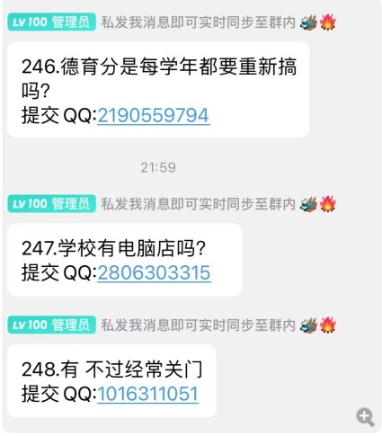
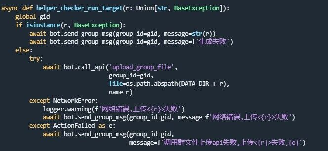
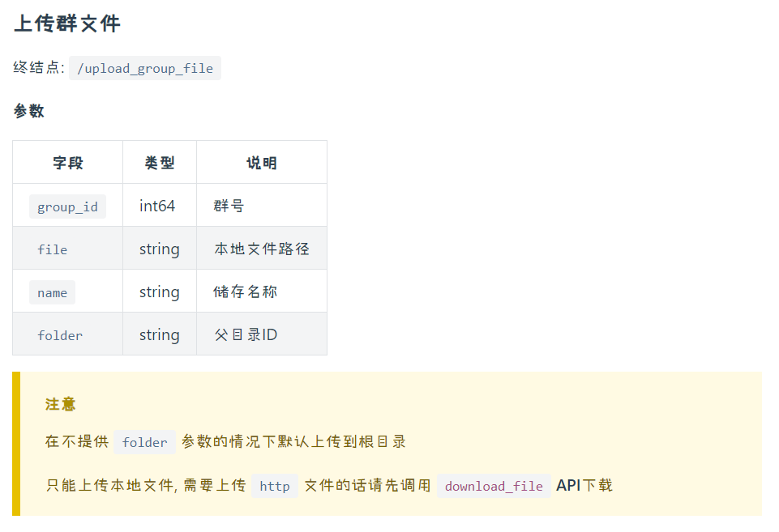

# CUIT_XiaoXingCampus_QQBot

## 1 版本更新

### V 1.0

- 实现了整体框架
- 实现了基本的消息转发功能
  - **私聊消息** 可以参考 nonebot_plugin_smart_reply
  - **转发消息** 可参考插件商店的 nonebot_plugin_forwarder 转发姬插件



### V 1.1

- 修改发布人的信息展示方式

  ```
  20.菜鸟裹裹查
  来源：发发[1315000000]
  ```

### V 2.0

- 使用```GitHub```托管代码

- 修改发布人的信息展示方式

  ```
  提交来源：xxxxxx
  提交QQ：xxxx
  ```

- 发送群文件功能

  给小杏发送文件，小杏会发送到群文件

  - 接收文件很简单嘛，看控制台的```log```就知道是一个```[notice.offline_file]```

  - 发送群文件似乎没有公开的```api```，需要调用```go-cqhttp```的[接口](https://docs.go-cqhttp.org/api/#%E5%88%9B%E5%BB%BA%E7%BE%A4%E6%96%87%E4%BB%B6%E6%96%87%E4%BB%B6%E5%A4%B9)，较复杂。感谢```nonebot```交流群（768176998）的大佬们的不吝赐教。

    

    

  - 一般来说，先需要下载文件到本地，可以用```go-cqhttp```接口，也可以用```requests```库。为了提高速度，可以把文件保存到内存中（使用内存管理器），关于这一点，在[这个视频](https://www.bilibili.com/video/BV1At4y1Y7m7/?p=18)的```14:00```。但是我没搞出来 我丢本地的...

- 添加帮助功能

  给小杏发送关键词**帮助**，小杏会回复帮助信息，关于机器人的功能点与```GitHub```地址

### V 3.0

> 待完善 等我学```sql```
>
> 我真的是废物 数据库都不会 这下好了 ```2.0```的功能丢到```3.0```来了

- 使用```sql```本地化数据

- 可自定义昵称

- 添加消息撤回功能

  > 我发现这个需求的实现好复杂 应该是要用数据库才会比较舒服
  >
  > 具体实现需要对私聊的消息 记录其```message_id```
  >
  > 同时记录机器人转发到各群消息时返回的```message_id```
  >
  > 上述两者形成**一对多**的关系 这样才能很好的处理这个需求

  撤回发送给小杏的消息，小杏会撤回群里面的消息

  机器人消息撤回参考：```nonebot```插件商店[主动消息撤回](https://github.com/ssttkkl/nonebot-plugin-revoke)

- 添加回复与艾特功能

  > 实现了数据库储存 这些也比较舒服了

  - 转发时将发送消息中**回messageID**，即添加回复的源信息

    ```python
    # 发送消息
    回111，太强了
    
    # 转发消息
    112.回111，太强了
    --------------------
    111.我是废物
    --------------------
    提交来源：阿巴阿巴
    提交QQ：123456789
    ```

  - 转发时将发送消息中的**艾特messageID**更改为**@nickname**

    ```python
    # 发送消息
    你好强啊艾特111，太强了
    
    # 转发消息
    112.你好强啊 @发发 ，太强了
    --------------------
    提交来源：阿巴阿巴
    提交QQ：123456789
    ```

## 2 安装

https://www.bilibili.com/video/BV1aZ4y1f7e2

### 2.1 依赖库

- https://github.com/mrs4s/go-cqhttp/releases

- ```linux```可能要单独安装下面这个

  pip install nonebot-adapter-onebot

### 2.2 备忘记录

> 快跑 这个甲方不懂技术 预算低
>
> 憨憨甲方 GitHub链接都不准留

- 选择 反向 Websocket 通信

- config.yml

  - uin: xxxx # QQ账号
  - 端口
    - universal: ws://your_websocket_universal.server   ->   ws://127.0.0.1:27182/onebot/v11/ws/   (10000-60000随机数)

- 登录不畅可删除 session.token

- 之后运行都是.bat文件

- 打开 windows Powershell

  - nb create
  - src
  - echo
  - v11

- .env 改成 prod

- .env.prod

  ```python
  # 好像这里面一定要双引号
  HOST=127.0.0.1  # 主机名
  PORT=27182  # 监听的端口
  # SUPERUSERS=["123456"]  # 超级用户
  NICKNAME=["小杏"]  # 机器人昵称
  COMMAND_START=["/"]  # 命令起始字符   "" 会把所有都视为命令
  # COMMAND_SEP=["."]  # 命令分割符 一般不用
  ```

- 运行 bot.py 与 go-cqhttp.bat 文件即可

- ```screen```基本操作

  退出screen

  ```
  Ctrl+A+D
  ```

  创建screen

  ```
  screen -R name
  ```

  进入screen

  ```
  screen -r name
  ```

